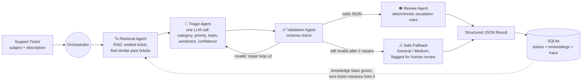
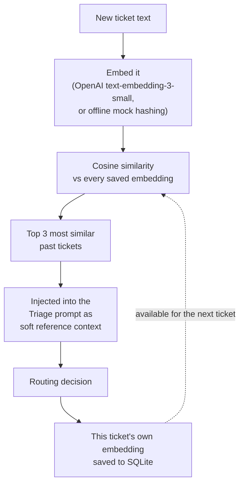
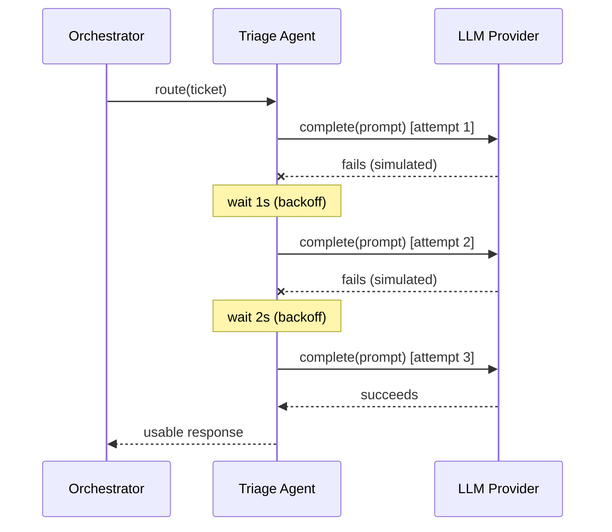

# ◆ AI Smart Ticket Router

**Odyssey 2026 · Port·04 — The Senate of Gods**
Built by **Vishal Hota**, AI Intern, Calfus


> "Support teams are drowning in tickets. What if the ticket routed itself?"

---

## 🐙 The story

Every support team has the same 2am problem: a wall of tickets, no consistent way to triage them, and a human somewhere deciding — half by instinct, half by fatigue — what's urgent, who owns it, and how annoyed the customer sounds. That judgment call, repeated hundreds of times a day, is exactly the kind of structured, repeatable decision an AI agent pipeline is good at making faster and more consistently than a tired human at the end of a shift.

This AI Smart Ticket Router is that pipeline: **four coordinated AI agents** that take a raw support message and hand back a fully structured decision — category, priority, assigned team, one-line reasoning, a confidence score, and the customer's emotional tone — as clean, validated JSON.

> ### 🤖 The headline feature: this is genuinely agentic, not one prompt wearing a trench coat.
> Every ticket passes through **four separate agents** — Retrieval, Triage, Validation, Review — each with one job, each independently testable, coordinated by a single orchestrator through a shared context object. Swap any one agent out and the other three don't need to know or care. That's the actual architectural bet this project makes, and everything else (RAG, resilience, self-repair) is built on top of it.

---

## ⚡ Why this isn't just "call an LLM and hope"

| Problem with the naive approach | What this project does instead |
|---|---|
| LLMs sometimes return broken JSON | A dedicated **Validation Agent** catches it, shows the AI its own mistake, and asks for a fix — up to twice — before falling back to a safe, human-flagged default. Never crashes, never silently ships garbage. |
| LLM APIs sometimes fail transiently | A **retry-with-exponential-backoff** layer catches transient failures and recovers automatically. This isn't just claimed — a fault-injection script (`scripts/demo_retry_proof.py`) deliberately breaks a real call and proves the recovery live. |
| "Trust the AI's confidence score" is fragile | Escalation to a human is decided by **fixed, deterministic rules** (confidence threshold, category, sentiment, ticket length) — not another AI call. Every escalation is explainable after the fact. |
| Every ticket is judged in isolation | A **Retrieval-Augmented Generation (RAG)** step embeds every incoming ticket, finds the most similar tickets ever routed before, and feeds them to the triage prompt as reference context — so routing gets *more consistent over time*, not just repeatedly re-guessed from scratch. |
| Nothing to show for it afterward | Every ticket, decision, and agent trace is persisted to SQLite and browsable in a **Past Tickets** tab, Gmail-inbox style. |

---

## 🤖 Agentic Architecture — the star of the show



Every arrow above is a real, tested code path — not a simplification. The dotted line back into the Retrieval Agent is the important one: this system gets *better reference data* the more it's used, without needing anyone to hand-curate a training set.

### The agent roster

| | Agent | Single responsibility | Calls an LLM? |
|---|---|---|---|
| 🔍 | **Retrieval Agent** | Embeds the ticket, finds similar past tickets (RAG) | Embeddings call only |
| 💬 | **Triage Agent** | Classifies category, priority, team, sentiment, confidence | ✅ Yes |
| ✅ | **Validation Agent** | Enforces the JSON schema, self-repairs malformed output | Only if a repair is needed |
| 👁 | **Review Agent** | Deterministic escalation rules — no guessing | ❌ No — pure business logic |

Four agents, four narrow jobs, one shared `TicketContext` passed hand to hand between them. That separation is what makes every piece of this system — the RAG layer, the retry/backoff resilience, the self-repair loop — independently swappable and independently testable, instead of one giant prompt trying to do everything at once.

---

## 🔎 RAG: where it's used, and why

**Where:** `agents/retrieval_agent.py` runs first, before triage. It embeds the incoming ticket's text, compares it by cosine similarity (`rag/retriever.py`, pure NumPy) against every past ticket's saved embedding in SQLite, and hands the top 3 matches to `TriageAgent` as soft reference context in the prompt: *"here's how similar past tickets were actually routed."*

**Why:** three concrete reasons, not just "because RAG is trendy":

1. **Consistency.** Without it, two nearly-identical tickets submitted an hour apart could get different categories purely from LLM sampling variance. With retrieved precedent in the prompt, the model has something concrete to stay consistent with.
2. **No cold-start dataset needed.** Instead of requiring a pre-labeled historical ticket dataset (which most teams don't have on day one), the knowledge base **is the app's own usage history** — it starts empty and grows by one entry every time a ticket is routed.
3. **Works offline too.** In `LLM_PROVIDER=mock` mode, embeddings come from a deterministic feature-hashing bag-of-words function (`llm/mock_embeddings_client.py`) instead of a real API call — so the entire retrieval mechanism can be demoed and tested for free, with zero network dependency, using the exact same code path as production.



RAG here is a genuine enhancement layer, not a hard dependency: if the embeddings call fails for any reason, the orchestrator logs it and continues routing normally without reference context, rather than failing the whole request.

---

## 🛡 Resilience: proving it, not just claiming it

`orchestration/resilience.py` wraps every LLM call in retry-with-exponential-backoff (3 attempts, 1s then 2s delay). Rather than asking you to trust that this code "looks right," the Single Ticket tab has a **"Simulate a transient AI failure"** checkbox that deliberately routes the call through a `FlakyClient` wrapper (`llm/flaky_client.py`) which fails the first two attempts on purpose. Submit it, and watch the real retry log:



A standalone script, `scripts/demo_retry_proof.py`, runs this exact scenario outside the UI and prints the attempt-by-attempt log plus a pass/fail assertion — genuine proof for a mentor demo, runnable in ~3 seconds.

**Beyond retrying transient failures, the orchestrator also degrades gracefully if the AI provider is fully unreachable** — an invalid/expired API key, a dead network, a sustained rate limit. Rather than let that raise an unhandled error, `TriageAgent`'s call is wrapped the same way `RetrievalAgent`'s already was: on any failure it falls back to the same safe, human-flagged result a broken-JSON validation failure produces (`General` / `Medium` / needs review), saves it, and returns a normal 200 response instead of a 500. Verified with a dedicated regression test (`test_route_degrades_gracefully_when_llm_provider_is_unreachable`) that forces every call to fail and asserts the API never crashes.

Two more small but deliberate reliability choices: the OpenAI triage call runs at `temperature=0` (a classification decision should be as reproducible as possible — the same ticket submitted twice should get an equivalent answer, not a coin-flip), and `Ticket.subject`/`description` are capped at 300/5000 characters so one oversized paste can't balloon LLM cost or hit a provider token limit unpredictably.

---

## 🖥 Admin Console — the operational side of the same app

Everything above describes the AI pipeline; this is what a real support team actually does with its output. A **Customer / Admin view toggle** in the header switches between the two — no login (a deliberate demo-scope choice, not an oversight; see Known Limitations) — but the underlying data is exactly the same:

- **Jira-style Kanban board** (New → In Progress → Resolved → Closed) on both the customer's Past Tickets tab (read-only) and the Admin Console (editable), sorted by priority within each column, backed by an indexed `status` column so it stays fast as the ticket count grows.
- **Employee & department directory** — a realistic 15-department org chart (IT, Finance, Security, HR, Legal, Sales, Engineering, etc.), each with seeded employees. An admin can add more of either at any time.
- **Automatic, load-balanced assignment** — every routed ticket is assigned server-side to the least-busy active employee in the department mapped from the AI's team decision (fewest open New/In Progress tickets, ties broken deterministically). A ticket that lands directly on someone's desk starts at **In Progress**, not **New** — an assigned ticket sitting in a "not yet picked up" column would be a contradiction.
- **Admin overrides** — an admin can correct the AI's category/priority/team, add a resolution note, or reassign to a different employee. The AI's original call is never overwritten, only stored alongside the correction, so both stay visible and auditable.

## 📎 Ticket attachments

Optional file upload (image, video, PDF, or doc — 5MB cap) on the Single Ticket tab. Stored as base64 directly on the ticket row (no separate blob store needed at this scale) and served back through a dedicated `GET /tickets/{id}/attachment` endpoint with the correct content type and an `inline` disposition, so clicking "View attachment" opens it in a new tab instead of forcing a download. The filename is sanitized before it ever reaches an HTTP header, so a filename containing a stray quote or line break can't inject into the response.

## 📊 Business analytics

A third Admin Console tab answers the questions a real support manager would actually ask: which department is getting the most tickets (chart), category/priority/sentiment breakdown, how much an admin has had to correct the AI (a trust/accuracy proxy), how evenly workload is spread across employees, and average time-to-resolution. All plain historical aggregates — nothing here enforces a deadline or threshold (deliberately not an SLA/aging system).

---

## 📈 V1 → V2 → V3: how this evolved

| Stage | What it added |
|---|---|
| **V1** | Single-call triage prompt (category, priority, team, reasoning) returned as structured JSON; mock and OpenAI providers behind one swappable interface; basic web UI. |
| **V2 — Foundations** | SQLite persistence for every routed ticket, retry-with-backoff resilience, structured logging with correlation IDs, full automated test suite, standalone HTML/CSS/JS UI with a live agent-orchestration diagram. |
| **V2.1 — Mission alignment** | Sentiment analysis folded into the same triage call (no extra cost), the 3 required edge cases (angry / very short / ambiguous) handled with dedicated tests, 20-sample-ticket CSV, manual-vs-AI time comparison. |
| **V2.2 — Refinement pass** | Deterministic escalation for very-short/vague tickets (not left to AI self-reported confidence), tightened sentiment prompt calibration, live "Retry & Anomaly Log" panel, fault-injection proof of resilience. |
| **V2.3 — RAG** | Retrieval Agent as a real 4th pipeline step, OpenAI + offline mock embeddings, cosine-similarity knowledge base that grows with usage, "Similar Tickets Used" live panel, "Past Tickets" inbox-style browsing tab, raw JSON output with one-click copy. |
| **V3 — Admin Console** | Ticket lifecycle (`New`/`In Progress`/`Resolved`/`Closed`), Customer/Admin view toggle, Jira-style Kanban board on both sides, 15-department employee directory with automatic load-balanced assignment, admin correction/override workflow. |
| **V3.1 — Attachments & Analytics** | Optional file attachments on tickets (base64-stored, served via a dedicated endpoint with sanitized headers), a business analytics dashboard (department/category/priority/sentiment breakdown, AI trust metrics, employee workload, daily volume, avg resolution time). |
| **V3.2 — Reliability & security hardening** | Graceful fallback (not a crash) when the AI provider is fully unreachable, `temperature=0` for consistent classification, input length caps, attachment-filename header sanitization — closing gaps found by re-testing against the mission's own integration-quality checks. |

---

## 🚀 Quickstart

```bash
python3 -m venv venv
source venv/bin/activate
python3 -m pip install -r requirements.txt
```

Create a `.env` file at the project root (copy `.env.example`) with your own values:

```
LLM_PROVIDER=openai
OPENAI_API_KEY=sk-your-real-key-here
OPENAI_MODEL=gpt-4o-mini
EMBEDDING_MODEL=text-embedding-3-small
DATABASE_URL=sqlite:///./ticket_router.db
MAX_REPAIR_ATTEMPTS=2
CONFIDENCE_THRESHOLD=70
```

No API key yet? Set `LLM_PROVIDER=mock` instead — the whole system, including RAG's embeddings, runs on deterministic, offline logic with no network calls or cost. Useful for development and for the automated test suite.

Run the service:

```bash
PYTHONPATH=src python3 -m uvicorn ticket_router.api.main:app --reload
```

Open **http://127.0.0.1:8000/** in a browser. That's the whole demo — no separate frontend process needed.

Run the test suite:

```bash
PYTHONPATH=src python3 -m pytest
```

Prove resilience live, outside the UI:

```bash
LLM_PROVIDER=mock DATABASE_URL="sqlite:///./demo_retry.db" PYTHONPATH=src python3 scripts/demo_retry_proof.py
```

---

## 🎬 Demoing it

1. **Single Ticket tab** — submit a ticket and watch the "Agent Orchestration" panel light up as `RetrievalAgent`, `TriageAgent`, `ValidationAgent`, and `ReviewAgent` each complete, with real measured durations. If a similar past ticket exists, a "Similar Tickets Used (RAG)" panel appears showing exactly what was retrieved and its similarity score. The full raw JSON response is shown at the bottom with a one-click copy button.
2. **Batch Upload (CSV) tab** — upload `sample_tickets_20.csv` (20 tickets, every category and priority, with the 3 required edge cases embedded). Shows a results table, summary stats, and a documented manual-vs-AI time comparison.
3. **Past Tickets tab** — every ticket ever routed, as a Jira-style Kanban board (New/In Progress/Resolved/Closed). Click a card for full detail, agent trace, and attachment (if any). Optional "only show tickets I submitted from this browser" filter.
4. **Manual Timing Trial tab** — a real, self-timed manual-vs-AI comparison: you classify a real sample ticket yourself with the clock running, then see it side by side with the AI's own decision and timing.
5. **Admin View** — toggle in the header (no login, demo-scope only). **Ticket Queue** sub-tab: the same Kanban board, editable — correct the AI's call, leave a resolution note, reassign to a different employee. **Team Directory** sub-tab: manage the 15-department org chart and its employees. **Analytics** sub-tab: department/category/priority/sentiment breakdown, AI trust metrics, employee workload, daily volume.
6. **GET /tickets/{id}** — look up any previously routed ticket directly, e.g. `http://127.0.0.1:8000/tickets/482`.
7. **GET /stats/analytics** — the same data backing the Analytics tab, as raw JSON.

---

## 🛠 Tech stack


| Layer | Choice | Why |
|---|---|---|
| API | FastAPI + Uvicorn | async-native, automatic OpenAPI docs at `/docs` |
| Validation | Pydantic v2 + pydantic-settings | strict schema enforcement, typed settings from `.env` |
| LLM | OpenAI (`gpt-4o-mini`) | real structured-output-capable model, JSON mode |
| LLM fallback | Deterministic mock client | free, offline, identical interface (`Protocol`-based) |
| Embeddings / RAG | OpenAI `text-embedding-3-small` + cosine similarity (NumPy) | no separate vector database needed at this scale — embeddings live directly in SQLite |
| Embeddings fallback | Feature-hashing bag-of-words | free, offline, same interface as the real provider |
| Database | SQLite via SQLAlchemy ORM | zero-setup persistence, ships with every ticket + its trace + its embedding |
| Frontend | Vanilla HTML/CSS/JS, single file | served same-origin by FastAPI — no CORS, no build step, no separate process. Chart.js (CDN) is the one deliberate exception, used only for two Analytics visuals. |
| Testing | pytest + pytest-asyncio | 21 tests across agents, orchestration, edge cases, resilience, RAG math, and API round-trips |

---

## ✅ Mission deliverables checklist

- [x] Design prompts that consistently return valid structured JSON
- [x] Handle 3 edge cases: angry tone, very short message, ambiguous ticket
- [x] Build a simple interface (web UI) to test it
- [x] Show before/after: manual routing time vs. AI routing time
- [x] Demo 20 sample tickets to mentor (`sample_tickets_20.csv`)
- [x] Public GitHub repository with setup instructions and a working demo (this repo)

**Beyond the brief:**

- [x] RAG retrieval layer + self-growing knowledge base
- [x] Real, self-timed manual-vs-AI trial (not just an assumed baseline)
- [x] Full ticket lifecycle + Jira-style Kanban board on both customer and admin sides
- [x] 15-department employee directory with automatic, load-balanced ticket assignment
- [x] Admin correction/override workflow with full audit trail (AI's original call never overwritten)
- [x] Optional ticket attachments (image/video/PDF/doc)
- [x] Business analytics dashboard (department/category/priority/sentiment, AI trust metrics, workload, volume, resolution time)
- [x] Graceful degradation on AI provider outage, proven with a dedicated regression test

---

## 📜 How it works, in one paragraph

A ticket arrives and is first passed to the **Retrieval Agent**, which embeds it and pulls back the most similar tickets ever routed before. The **Triage Agent** asks the configured LLM for category, priority, team, reasoning, confidence, and sentiment — in one call, using those similar past tickets as reference — instead of five separate calls. The **Validation Agent** checks that response against a strict schema; if it's malformed, it shows the AI its own mistake and asks for a correction, up to twice, before falling back to a safe, human-flagged default rather than crashing. The **Review Agent** applies fixed, deterministic rules (confidence threshold, security category, angry/frustrated tone, very short tickets, any repair having occurred) to decide the final `needs_human_review` value — no AI call, so every escalation is explainable. The orchestrator times and logs every step under a per-ticket correlation ID, and saves the full result, trace, and embedding to SQLite — which is exactly what the next ticket's Retrieval Agent will search through.

Full architectural detail, design rationale, and a beginner-friendly walkthrough of every file are in [`ARCHITECTURE.md`](ARCHITECTURE.md), [`PROJECT_OVERVIEW.md`](PROJECT_OVERVIEW.md), and [`V1_DOCUMENTATION.md`](V1_DOCUMENTATION.md). A running glossary of every technical term used, with real-life analogies, is in [`STUDY_GUIDE.md`](STUDY_GUIDE.md).

---

## 🗂 Project structure

```
src/ticket_router/
  domain/          data models, enums, custom exceptions
  llm/             provider-agnostic LLM + embeddings clients (mock + OpenAI)
  rag/             cosine-similarity retrieval over saved embeddings
  agents/          RetrievalAgent, TriageAgent, ValidationAgent, ReviewAgent
  orchestration/   the orchestrator + retry/backoff resilience
  persistence/     SQLite storage for tickets, embeddings, and agent traces
  observability/   structured, correlation-ID-tagged logging
  config/          environment-driven settings
  api/             FastAPI service
    routes/        tickets, admin, employees, stats (incl. analytics), health -- one file per concern
  ui/              standalone HTML/CSS/JS frontend, served by the API
scripts/
  demo_retry_proof.py   standalone proof that retry/backoff recovers from a real induced failure
tests/
  unit/            agents, orchestration, edge cases, resilience, RAG retrieval math
  integration/     full API round-trip tests
```

---

## ⚠️ Known limitations / not yet built

- Repository calls are synchronous SQLAlchemy calls made directly inside async code — fine at this scale, a production system would use an async driver or a thread pool.
- No auth or rate limiting — anyone reaching the API can submit unlimited tickets (and OpenAI spend), and the Customer/Admin toggle is a UI switch, not a security boundary. Fine for a demo, not for production. A consequence of no auth: ticket IDs are client-generated (UUID) with no ownership model, so the Past Tickets board shows every ticket in the system by default (a "only show tickets I submitted from this browser" filter, backed by localStorage rather than real auth, narrows this for the demo).
- Embeddings are stored as JSON text in SQLite rather than a dedicated vector database — a deliberate simplicity choice at this scale, since the knowledge base is small enough that brute-force cosine similarity over a few hundred/thousand rows is instant.
- No email notifications and no SLA/aging/escalation-by-deadline logic — the Analytics tab reports a plain historical average resolution time, but nothing here tracks or enforces a response-time target. Out of scope by design for this round of work, not an oversight.

---

*AI Smart Ticket Router — built by Vishal Hota, Calfus.*
